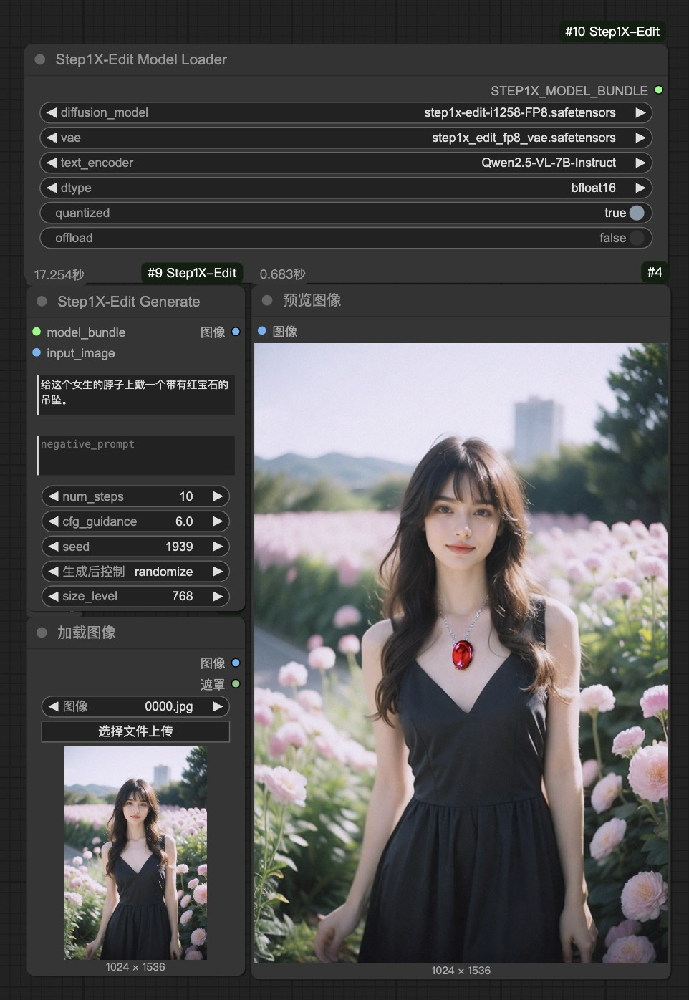
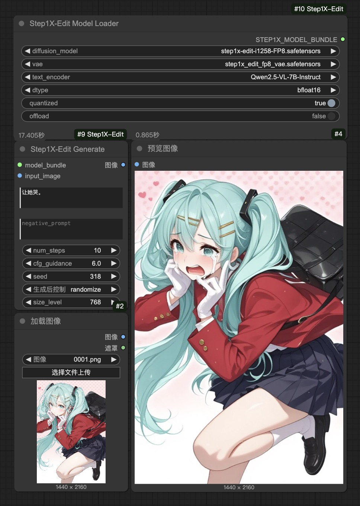

# ComfyUI_Step1X-Edit

[English](README.md) | [中文文档](README_CN.md)

This custom node integrates the [Step1X-Edit](https://github.com/stepfun-ai/Step1X-Edit) image editing model into [ComfyUI](https://github.com/comfyanonymous/ComfyUI). Step1X-Edit is a state-of-the-art image editing model that processes a reference image and user's editing instruction to generate a new image.

## Features

- [x] Support for FP8 inference
- [ ] Optimizing inference speed

## Examples

Here are some examples of what you can achieve with ComfyUI_Step1X-Edit:

| Example 1 | Example 2 |
|:-----------:|:------------:|
| "Add pendant with a ruby around this girl's neck."| "Let her cry." |
|  |  |

You can find the example workflow in the [examples directory](examples/step1x_edit_example.json). Load it directly into ComfyUI to see how it works.

## Installation

1.  **Clone this repository into your ComfyUI's `custom_nodes` directory:**
    ```bash
    cd ComfyUI/custom_nodes
    git clone https://github.com/raykindle/ComfyUI_Step1X-Edit.git
    ```

2.  **Install the required dependencies:**

    *Step 1: Install ComfyUI_Step1X-Edit dependencies*
    ```bash
    cd ComfyUI_Step1X-Edit
    pip install -r requirements.txt
    ```

    *Step 2: Install [`flash-attn`](https://github.com/Dao-AILab/flash-attention), here we provide a script to help find the pre-built wheel suitable for your system.*
    ```bash
    python utils/get_flash_attn.py
    ```
    The script will generate a wheel name like `flash_attn-2.7.2.post1+cu12torch2.5cxx11abiFALSE-cp310-cp310-linux_x86_64.whl`, which could be found in [the release page of flash-attn](https://github.com/Dao-AILab/flash-attention/releases).

    Then you can download the corresponding pre-built wheel and install it following the instructions in [`flash-attn`](https://github.com/Dao-AILab/flash-attention).

3.  **Download Step1X-Edit-FP8 model**
    ```
    ComfyUI/
    └── models/
        ├── diffusion_models/
        │   └── step1x-edit-i1258-FP8.safetensors
        ├── vae/
        │   └── vae.safetensors
        └── text_encoders/
            └── Qwen2.5-VL-7B-Instruct/
    ```
    - Step1X-Edit diffusion model: Download `step1x-edit-i1258-FP8.safetensors` from [HuggingFace](https://huggingface.co/meimeilook/Step1X-Edit-FP8/tree/main) and place it in ComfyUI's `models/diffusion_models` directory
    - Step1X-Edit VAE: Download `vae.safetensors` from [HuggingFace](https://huggingface.co/meimeilook/Step1X-Edit-FP8/tree/main) and place it in ComfyUI's `models/vae` directory
    - Qwen2.5-VL model: Download [Qwen2.5-VL-7B-Instruct](https://huggingface.co/Qwen/Qwen2.5-VL-7B-Instruct/tree/main) and place it in ComfyUI's `models/text_encoders/Qwen2.5-VL-7B-Instruct` directory

## Usage

1. Start ComfyUI and create a new workflow.
2. Add the "Step1X-Edit Model Loader" node to your workflow.
3. Configure the model parameters:
   - Select `step1x-edit-i1258-FP8.safetensors` as the diffusion model
   - Select `vae.safetensors` as the VAE
   - Set `Qwen2.5-VL-7B-Instruct` as the text encoder
   - Set additional parameters (`dtype`, `quantized`, `offload`) as needed
4. Connect an "Step1X-Edit Generate" node to the model node.
5. Provide an input image and an editing prompt.
6. Run the workflow to generate edited images.

## Parameters

### Step1X-Edit Model Loader

- `diffusion_model`: The Step1X-Edit diffusion model file (select from the diffusion_models dropdown)
- `vae`: The Step1X-Edit VAE file (select from the vae dropdown)
- `text_encoder`: The path to the Qwen2.5-VL model directory name (e.g., "Qwen2.5-VL-7B-Instruct")
- `dtype`: Model precision (bfloat16, float16, or float32)
- `quantized`: Whether to use FP8 quantized weights (true recommended)
- `offload`: Whether to offload models to CPU when not in use

### Step1X-Edit Generate

- `model`: The Step1X-Edit model bundle
- `image`: The input image to edit
- `prompt`: Text instructions describing the desired edit
- `negative_prompt`: Text describing what to avoid
- `steps`: Number of denoising steps (more steps = better quality but slower)
- `cfg_scale`: Guidance scale (how closely to follow the prompt)
- `image_size`: Size of the output image (512 recommended)
- `seed`: Random seed for reproducibility

## Memory Requirements

The Step1X-Edit model requires significant GPU memory:

|     Model Version   |     Peak GPU Memory (768px)  | 10 steps flash-attn(768px) |
|:------------:|:------------:|:------------:|
| Step1X-Edit-FP8   |             31.5GB     | 17s |

* The model is tested on one H20 GPUs.

For lower memory usage, enable the `quantized` and/or `offload` options in the Model Loader node.

## Troubleshooting

- If you encounter CUDA out of memory errors, try:
  - Enabling the `offload` option
  - Using the FP8 quantized model
  - Reducing the image size
  - Closing other GPU-intensive applications
- If you get errors about missing files:
  - Make sure your model paths are correct
  - The diffusion model should be in `models/diffusion_models`
  - The VAE should be in `models/vae`
  - The text encoder should be in `models/text_encoders/Qwen2.5-VL-7B-Instruct`
- If you get import errors, ensure all dependencies are installed correctly

## Acknowledgements

- The Step1X-Edit team for creating the original model
- ComfyUI for the extensible UI framework
