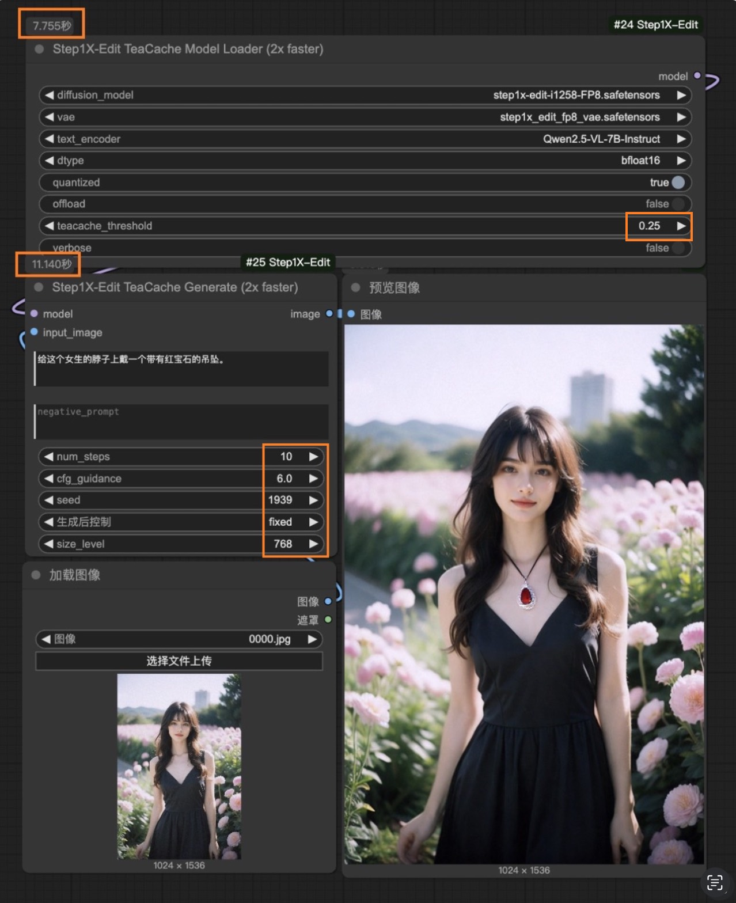
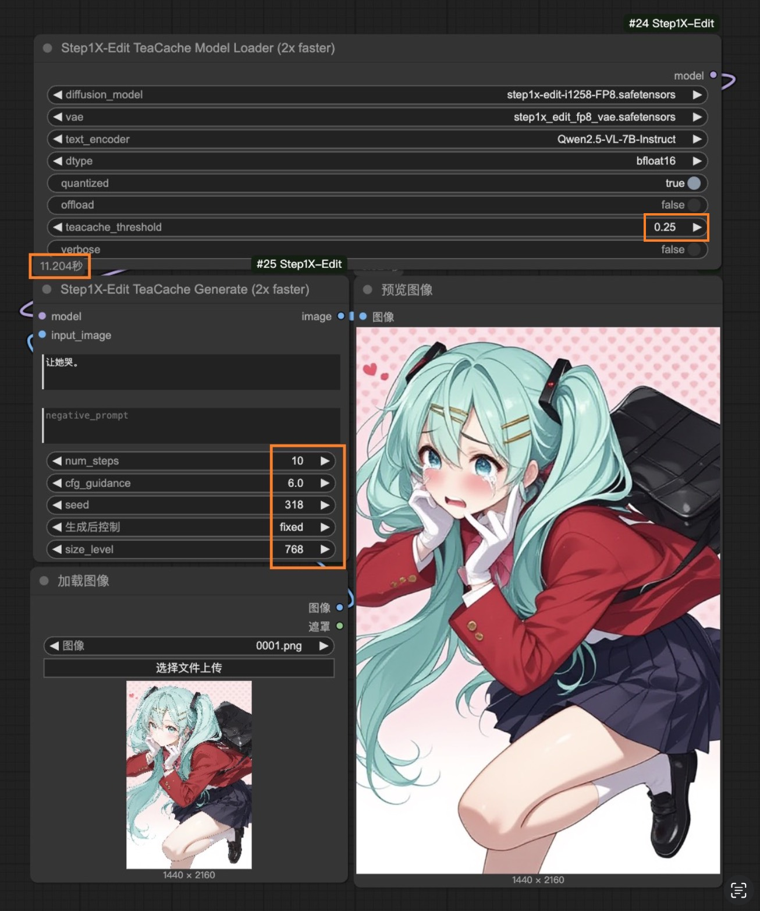

# ComfyUI_Step1X-Edit

[English](README.md) | [中文文档](README_CN.md)

This custom node integrates the [Step1X-Edit](https://github.com/stepfun-ai/Step1X-Edit) image editing model into [ComfyUI](https://github.com/comfyanonymous/ComfyUI). Step1X-Edit is a state-of-the-art image editing model that processes a reference image and user's editing instruction to generate a new image.

## Features

- [x] Support for FP8 inference
- [x] Support for flash-attn acceleration
- [x] Support TeaCache acceleration for 2x faster inference with minimal quality loss

## Examples

Here are some examples of what you can achieve with ComfyUI_Step1X-Edit:

<table>
  <tr>
    <th colspan="2" style="text-align: center">Example 1: "Add pendant with a ruby around this girl's neck."</th>
  </tr>
  <tr>
    <th style="text-align: center">Native</th>
    <th style="text-align: center">~1.5x Speedup（threshold=0.25）</th>
  </tr>
  <tr>
    <td></td>
    <td></td>
  </tr>
</table>

<table>
  <tr>
    <th colspan="2" style="text-align: center">Example 2: "Let her cry."</th>
  </tr>
  <tr>
    <th style="text-align: center">Native</th>
    <th style="text-align: center">~1.5x Speedup（threshold=0.25）</th>
  </tr>
  <tr>
    <td></td>
    <td></td>
  </tr>
</table>

You can find the example workflow in the [examples directory](examples/step1x_edit_example.json). Load it directly into ComfyUI to see how it works.

## Installation

1.  **Clone this repository into your ComfyUI's `custom_nodes` directory:**
    ```bash
    cd ComfyUI/custom_nodes
    git clone https://github.com/raykindle/ComfyUI_Step1X-Edit.git
    ```

2.  **Install the required dependencies:**

    *Step 1: Install ComfyUI_Step1X-Edit dependencies*
    ```bash
    cd ComfyUI_Step1X-Edit
    pip install -r requirements.txt
    ```

    *Step 2: Install [`flash-attn`](https://github.com/Dao-AILab/flash-attention), here we provide a script to help find the pre-built wheel suitable for your system.*
    ```bash
    python utils/get_flash_attn.py
    ```
    The script will generate a wheel name like `flash_attn-2.7.2.post1+cu12torch2.5cxx11abiFALSE-cp310-cp310-linux_x86_64.whl`, which could be found in [the release page of flash-attn](https://github.com/Dao-AILab/flash-attention/releases).

    Then you can download the corresponding pre-built wheel and install it following the instructions in [`flash-attn`](https://github.com/Dao-AILab/flash-attention).

3.  **Download Step1X-Edit-FP8 model**
    ```
    ComfyUI/
    └── models/
        ├── diffusion_models/
        │   └── step1x-edit-i1258-FP8.safetensors
        ├── vae/
        │   └── vae.safetensors
        └── text_encoders/
            └── Qwen2.5-VL-7B-Instruct/
    ```
    - Step1X-Edit diffusion model: Download `step1x-edit-i1258-FP8.safetensors` from [HuggingFace](https://huggingface.co/meimeilook/Step1X-Edit-FP8/tree/main) and place it in ComfyUI's `models/diffusion_models` directory
    - Step1X-Edit VAE: Download `vae.safetensors` from [HuggingFace](https://huggingface.co/meimeilook/Step1X-Edit-FP8/tree/main) and place it in ComfyUI's `models/vae` directory
    - Qwen2.5-VL model: Download [Qwen2.5-VL-7B-Instruct](https://huggingface.co/Qwen/Qwen2.5-VL-7B-Instruct/tree/main) and place it in ComfyUI's `models/text_encoders/Qwen2.5-VL-7B-Instruct` directory

## Usage

1. Start ComfyUI and create a new workflow.
2. Add the "Step1X-Edit Model Loader" node (or the faster "Step1X-Edit TeaCache Model Loader" for 2x speedup) to your workflow.
3. Configure the model parameters:
   - Select `step1x-edit-i1258-FP8.safetensors` as the diffusion model
   - Select `vae.safetensors` as the VAE
   - Set `Qwen2.5-VL-7B-Instruct` as the text encoder
   - Set additional parameters (`dtype`, `quantized`, `offload`) as needed
   - If using TeaCache, set an appropriate threshold value
4. Connect a "Step1X-Edit Generate" node (or "Step1X-Edit TeaCache Generate" if using TeaCache) to the model node.
5. Provide an input image and an editing prompt.
6. Run the workflow to generate edited images.

## Parameters

### Step1X-Edit Model Loader

- `diffusion_model`: The Step1X-Edit diffusion model file (select from the diffusion_models dropdown)
- `vae`: The Step1X-Edit VAE file (select from the vae dropdown)
- `text_encoder`: The path to the Qwen2.5-VL model directory name (e.g., "Qwen2.5-VL-7B-Instruct")
- `dtype`: Model precision (bfloat16, float16, or float32)
- `quantized`: Whether to use FP8 quantized weights (true recommended)
- `offload`: Whether to offload models to CPU when not in use

### Step1X-Edit TeaCache Model Loader (Additional Parameters)

- `teacache_threshold`: Controls the trade-off between speed and quality
  - `0.25`: ~1.5x speedup
  - `0.4`: ~1.8x speedup
  - `0.6`: 2x speedup (recommended)
  - `0.8`: ~2.25x speedup with minimal quality loss
- `verbose`: Whether to print TeaCache debug information

### Step1X-Edit Generate / Step1X-Edit TeaCache Generate

- `model`: The Step1X-Edit model bundle
- `image`: The input image to edit
- `prompt`: Text instructions describing the desired edit
- `negative_prompt`: Text describing what to avoid
- `steps`: Number of denoising steps (more steps = better quality but slower)
- `cfg_scale`: Guidance scale (how closely to follow the prompt)
- `image_size`: Size of the output image (512 recommended)
- `seed`: Random seed for reproducibility

## TeaCache Acceleration

This implementation includes TeaCache acceleration technology, which provides:

- 2x faster inference with no quality loss
- Training-free acceleration with no additional model fine-tuning
- Adaptive caching based on timestep embeddings
- Adjustable speed-quality trade-off via threshold parameter

TeaCache works by intelligently skipping redundant calculations during the denoising process. It analyzes the relative changes between steps and reuses previously computed results when possible, significantly reducing computational requirements without compromising output quality.

Based on [TeaCache](https://github.com/LiewFeng/TeaCache) research, which was developed for accelerating video diffusion models and adapted here for image generation.

## Memory Requirements

The Step1X-Edit model requires significant GPU memory: (768px, 10 step)

|     Model Version   |     Peak GPU Memory | Native | ~1.5x Speedup（threshold=0.25） | ~2.0x Speedup（threshold=0.6） |
|:------------:|:------------:|:------------:|:------------:|:------------:|
| Step1X-Edit-FP8(offload=False)   |       31.5GB     | 17.4s | 11.2s | 7.8s |

* The model is tested on one H20 GPUs.

For lower memory usage, enable the `quantized` and/or `offload` options in the Model Loader node.

## Troubleshooting

- If you encounter CUDA out of memory errors, try:
  - Enabling the `offload` option
  - Using the FP8 quantized model
  - Reducing the image size
  - Closing other GPU-intensive applications
- If you get errors about missing files:
  - Make sure your model paths are correct
  - The diffusion model should be in `models/diffusion_models`
  - The VAE should be in `models/vae`
  - The text encoder should be in `models/text_encoders/Qwen2.5-VL-7B-Instruct`
- If you get import errors, ensure all dependencies are installed correctly
- If you experience unexpected behavior with TeaCache:
  - Try different threshold values
  - Enable verbose mode to see which steps are being cached
  - Verify that the TeaCache model loader is properly connected to the TeaCache generate node

## Acknowledgements

- [Step1X-Edit](https://github.com/stepfun-ai/Step1X-Edit) for the original model
- [TeaCache](https://github.com/LiewFeng/TeaCache) for the acceleration technology
- [ComfyUI](https://github.com/comfyanonymous/ComfyUI) for the extensible UI framework
