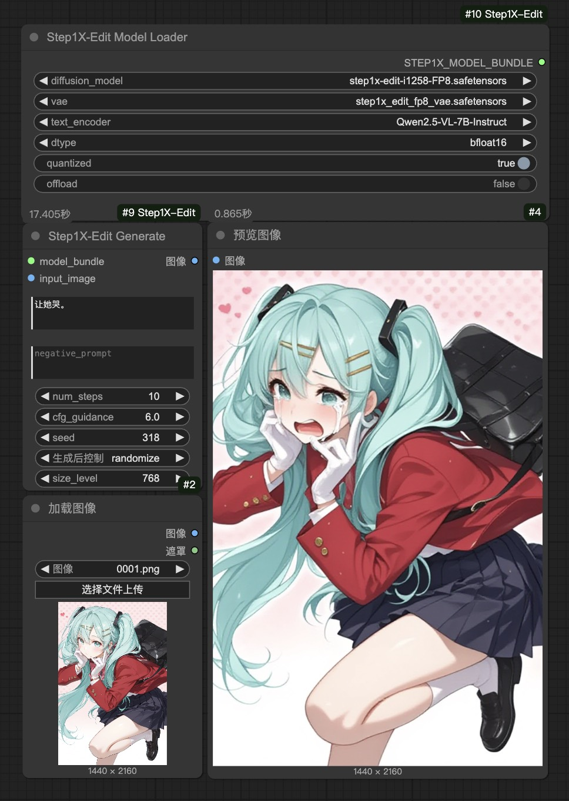

# ComfyUI_Step1X-Edit

[English](README.md) | [中文文档](README_CN.md)

此自定义节点将 [Step1X-Edit](https://github.com/stepfun-ai/Step1X-Edit) 图像编辑模型集成到 [ComfyUI](https://github.com/comfyanonymous/ComfyUI) 中。Step1X-Edit 是一个先进的图像编辑模型，它接收参考图像和用户的编辑指令，生成新的图像。

## 功能特点

- [x] 支持 FP8 推理
- [ ] 优化推理速度

## 示例展示

以下是使用 ComfyUI_Step1X-Edit 可以实现的效果示例：

| 示例 1 | 示例 2 |
|:-----------:|:------------:|
| "给这个女生的脖子上戴一个带有红宝石的吊坠。"| "让她哭。" |
|  |  |

您可以在[示例目录](examples/step1x_edit_example.json)中找到示例工作流。直接将其加载到 ComfyUI 中即可查看其工作原理。

## 安装方法

1.  **将此仓库克隆到 ComfyUI 的 `custom_nodes` 目录中：**
    ```bash
    cd ComfyUI/custom_nodes
    git clone https://github.com/raykindle/ComfyUI_Step1X-Edit.git
    ```

2.  **安装所需依赖：**

    *步骤 1: 安装 ComfyUI_Step1X-Edit的依赖*
    ```bash
    cd ComfyUI_Step1X-Edit
    pip install -r requirements.txt
    ```

    *步骤 2: 安装 [`flash-attn`](https://github.com/Dao-AILab/flash-attention)，我们提供了一个脚本，帮助您找到适合您系统的预编译轮子。*
    ```bash
    python utils/get_flash_attn.py
    ```
    该脚本将生成一个轮子名称，例如：`flash_attn-2.7.2.post1+cu12torch2.5cxx11abiFALSE-cp310-cp310-linux_x86_64.whl`，该名称可在 [flash-attn 的发布页面](https://github.com/Dao-AILab/flash-attention/releases) 中找到。

    然后，您可以下载相应的预编译轮子，并按照 [`flash-attn`](https://github.com/Dao-AILab/flash-attention) 中的说明进行安装。

3.  **下载 Step1X-Edit-FP8 模型**
    ```
    ComfyUI/
    └── models/
        ├── diffusion_models/
        │   └── step1x-edit-i1258-FP8.safetensors
        ├── vae/
        │   └── vae.safetensors
        └── text_encoders/
            └── Qwen2.5-VL-7B-Instruct/
    ```
    - Step1X-Edit 扩散模型：从 [HuggingFace](https://huggingface.co/meimeilook/Step1X-Edit-FP8/tree/main) 下载 `step1x-edit-i1258-FP8.safetensors` 并放置在 ComfyUI 的 `models/diffusion_models` 目录中
    - Step1X-Edit VAE：从 [HuggingFace](https://huggingface.co/meimeilook/Step1X-Edit-FP8/tree/main) 下载 `vae.safetensors` 并放置在 ComfyUI 的 `models/vae` 目录中
    - Qwen2.5-VL 模型：下载 [Qwen2.5-VL-7B-Instruct](https://huggingface.co/Qwen/Qwen2.5-VL-7B-Instruct/tree/main) 并放置在 ComfyUI 的 `models/text_encoders/Qwen2.5-VL-7B-Instruct` 目录中


## 使用方法

1. 启动 ComfyUI 并创建新的工作流。
2. 添加 "Step1X-Edit Model Loader" 节点到工作流中。
3. 配置模型参数：
    - 选择 `step1x-edit-i1258-FP8.safetensors` 作为扩散模型
    - 选择 `vae.safetensors` 作为 VAE
    - 设置 `Qwen2.5-VL-7B-Instruct` 作为文本编码器
    - 根据需要设置其他参数（`dtype`、`quantized`、`offload`）
4. 连接 "Step1X-Edit Generate" 节点到模型节点。
5. 提供输入图像和编辑提示。
6. 运行工作流生成编辑后的图像。

## 参数说明

### Step1X-Edit Model Loader（Step1X-Edit 模型加载器）

- `diffusion_model`：Step1X-Edit 扩散模型文件（从 diffusion_models 下拉菜单中选择）
- `vae`：Step1X-Edit VAE 文件（从 vae 下拉菜单中选择）
- `text_encoder`：Qwen2.5-VL 模型目录名称（例如 "Qwen2.5-VL-7B-Instruct"）
- `dtype`：模型精度（bfloat16、float16 或 float32）
- `quantized`：是否使用 FP8 量化权重（推荐 开启）
- `offload`：在不使用时是否将模型卸载到 CPU

### Step1X-Edit Generate（Step1X-Edit 生成）

- `model_bundle`：Step1X-Edit 模型包
- `input_image`：要编辑的输入图像
- `prompt`：描述所需编辑的文本指令
- `negative_prompt`：描述要避免的内容的文本
- `num_steps`：去噪步数（更多步数 = 更好的质量但更慢）
- `cfg_guidance`：引导系数（控制对提示的遵循程度）
- `size_level`：输出图像大小（推荐 512）
- `seed`：随机种子，用于可重现性

## 内存需求

Step1X-Edit 模型需要相当大的 GPU 内存：

|     模型版本   |     峰值 GPU 内存 (768px)  | 10 步 flash-attn(768px) |
|:------------:|:------------:|:------------:|
| Step1X-Edit-FP8   |             31.5GB     | 17s |

* 该模型在一张 H20 GPU 上测试。

为了降低显存使用，请在模型加载器节点中启用 `quantized` 和/或 `offload` 选项。

## 故障排除

- 如果遇到 CUDA 内存不足错误，请尝试：
  - 启用 `offload` 选项
  - 使用 FP8 量化模型
  - 减小图像大小
  - 关闭其他占用 GPU 的应用程序
- 如果遇到文件缺失错误：
  - 确保模型路径正确
  - 扩散模型应位于 `models/diffusion_models`
  - VAE 应位于 `models/vae`
  - 文本编码器应位于 `models/text_encoders/Qwen2.5-VL-7B-Instruct`
- 如果遇到导入错误，请确保所有依赖项都正确安装

## 致谢

- 感谢 Step1X-Edit 团队创建原始模型
- 感谢 ComfyUI 提供可扩展的 UI 框架